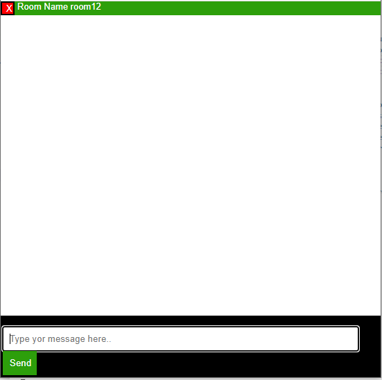
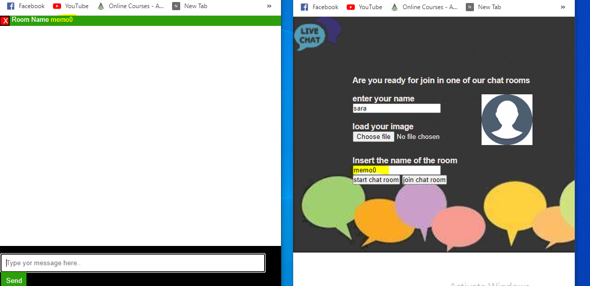
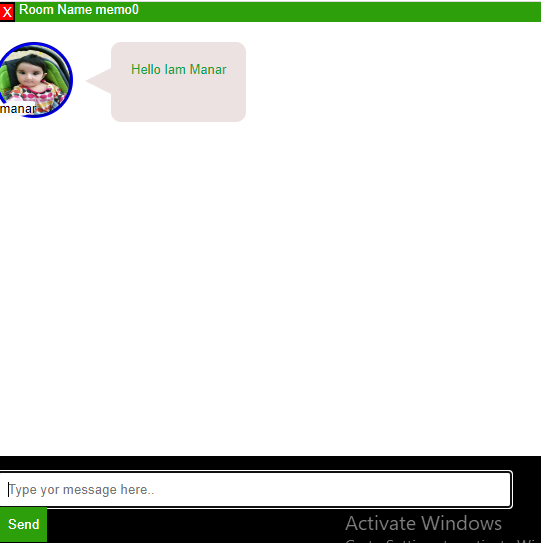
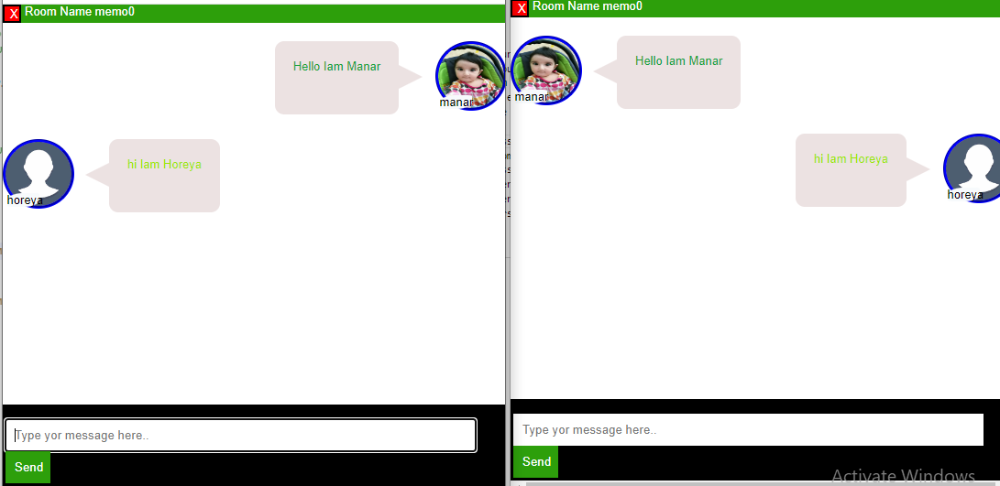
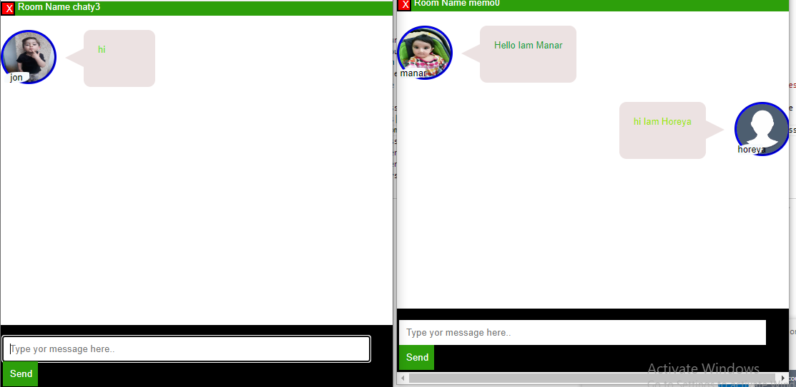

# Chat App

## Application requirement
-Node.js
-express
-socket.io
-dec-enc-lib

## Application advantages
- Application using pure javascript , express,node and socket.io .
- application can send just text message between  the participate in the same room 
- Application send notify when a new participate join in the room and when one let´ft and when one write .
- Users receive just message from the same room chat.
- Users send message to the members in the same room chat .
- User can create a new chatroom.
- user can join to the existing chatroom.
- Users know who send the message
- Application provide decryption and encryption .
## Application  development 
- Sending an error message when the user wants to join a non-existent room instead of creating a new room
- add a  voice call and video call to the chat.
- add the ability to send and receive photos.
- add database to save the conversations and the participates.
## Application problem 
 - When using (dec-enc-lib) library i could'nt use import from the node module so i added the library manuel (dec-enc-lib) to the client folder 
 - 

## testing
 | test cases | Input   | Output| PASS/FAIL | 
| --------- |---|-|----- | 
|user doesn't insert name  |user doesn't insert the name| error message appears "you should insert your name"| pass |
|user insert name but doesn't insert room name|user Insert the name (manar) but doesn't insert the room's name| error message appears""you should insert the room's name| pass|
|Users create  a new chatroom|insert the user name(Manar) and the name of the room(room12) ||pass|
|Users join to the existing room |insert the user name(Manar) and the name of the existing room(memo0) ||pass|
|Users send  messages to the common room|write the message and click on the send button message("Hello Iam Manar") ||pass|
|Users receive messages from the common room|  the user (Horeya) send a message("hi Iam Horeya") to the users in the room (memo0) and the user (Manar) receive the message| |pass|
|User can only see messages in his room and can't see messages in other rooms |user (jon )from the room (chaty3) can not see the message in the room (memo0)| |pass|
|User joins a non-existent room|user insert name(Manar) and room name (room1) and click on button join room | create a new room with the same name |pass|
| Users are notified when a user write message | user (manar) in the room (memo0) is writing a message |message appears " Manar typing " to all the users in the same room|pass|
|Users are notified when a user  left t the room|user (Manar) leave the room (memo0)| message appears "Manar has left " to all the users in the room (memo0)|pass|
| Users are notified when a user joins  the room |user (Manar) join to the room (memo0)| message appears "Manar has joined" to all the members in  the (memo) room|pass|

 ## modules
 ### Server.js
 -  server code where app uses socket.io and http server to emit messages between all the participants .
 ## Client
 ### Components

  I used following customElements  
 -  chat-box : It contains the main interface for chatting.
 - message-line : components for each message consists of one message and Photo-icon component
 - photo-icon : components consists of user's name  and user's photo .
 

