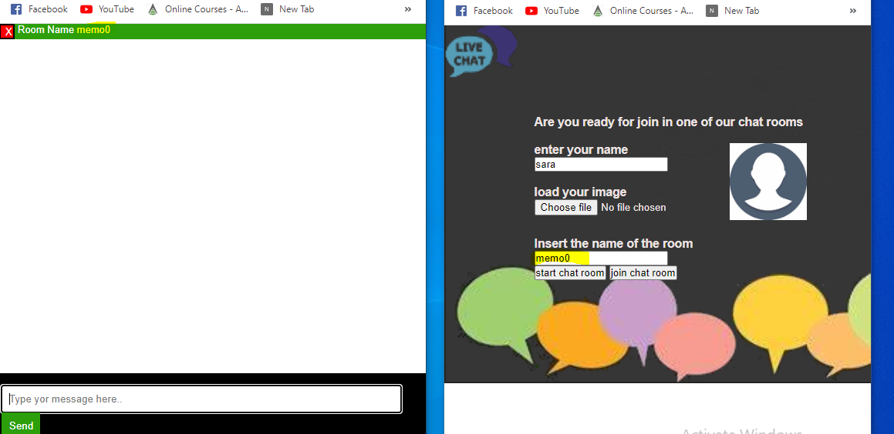

# Chat
- Realtime (chat) app built with pure JavaScript, Node, express and socket.io
- The app uses a library (dec-enc-lib) that I Wrote for encryption and decryption
## Installing
. download the project or clone it 
```shell
git clone repository link
```
. Navigate to the project's root.
```shell
cd  root
```
. install node packets.
```shell
npm install
```
. Create a .env file.
Copy and paste the texts in .env.example to .env and change the port value if you want

. Run the project
```shell
npm run dev
```
## Usage
-  The main interface for project 


- The user should insert his name and  chose name for the room .
- If the user do not insert (name , room's name ) error message appear 

 

 - The chat interface appears and contains the final room name that the user sends to other users (via SMS, email or other methods)

  

  - An unlimited number of members can participate in the room

   

   
   ## demo
   - demo video link
  -  https://youtu.be/FYC1I_oRTY0